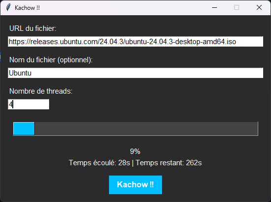

# 🚗 Flash McQueen Downloader

[](https://www.python.org/)
[](#)

Un **téléchargeur rapide et moderne pour Windows**, inspiré par Flash McQueen. Télécharge des fichiers via plusieurs threads pour booster la vitesse.  

---

## ⚡ Features

- Multi-thread download pour accélérer vos téléchargements  
- Barre de progression avec pourcentage et temps restant  
- Nom de fichier personnalisé avec extension automatique  
- Interface moderne et agréable pour Windows  
- Facile à utiliser : un seul `.exe` à lancer  

---

## 🛠 How it works (Windows only)

1. **Start**  
   Télécharge la dernière release et lance `FlashMcQueenDownloader.exe`.

2. **Find a download link**  
   Copie un lien direct vers un fichier (exemple :  
   `https://releases.ubuntu.com/24.04.3/ubuntu-24.04.3-desktop-amd64.iso`).

3. **Optional: Name your output file**  
   Entrez un nom sans extension (exemple : `Ubuntu`).  
   Le fichier final sera automatiquement `Ubuntu.iso`.

4. **Select number of threads**  
   Par défaut 4 threads, mais vous pouvez tester d’autres valeurs pour optimiser la vitesse sur votre machine.

5. **Download!**  
   Cliquez sur le bouton **Kachow !!** et regardez la magie opérer.  
   Le fichier téléchargé se trouvera dans le même dossier que `FlashMcQueenDownloader.exe`.

---

## 🎨 Screenshots



*Interface moderne avec barre de progression et options multi-thread*

---

## 📦 Installation

1. Télécharge la dernière release depuis [Releases](https://github.com/ton-compte/FlashMcQueenDownloader/releases).  
2. Télécharge `FlashMcQueenDownloader.exe` dans le dossier de ton choix.  
3. Lance l’exécutable (aucune installation supplémentaire requise).  

---

## ⚙ Requirements (for dev)

Si tu veux compiler ou modifier le projet :  

```bash
Python 3.14+
pip install -r requirements.txt
